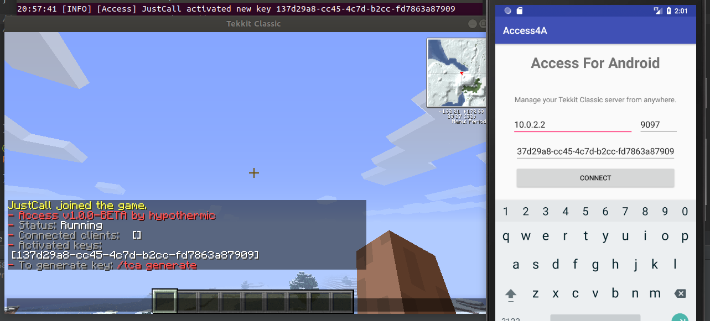

## Access
Access is a remote management plugin for Tekkit Classic. When this plugin is enabled, you can control your Tekkit server with the Android app. (more platforms coming)

### Installation
You can install Access like any other Bukkit plugin, **make sure** that you have defined a path to your Java Keystore (for SSL encryption) in the config.yml

#### Optional
It is heavily recommended to generate your own Java Keystore instead of using the included one. Sample command for Linux using `keytool`:
- `keytool -genkey -v -keystore tca.keystore -alias tcassl -keyalg RSA -keysize 4096 -validity 200`

### TODO:
- Save keylist to disk when restarting plugin or server.
- List users in Android app.
- Push notifications for Android app.